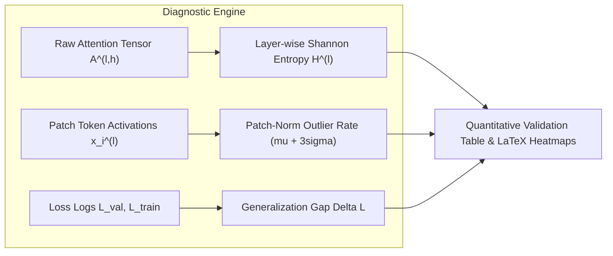
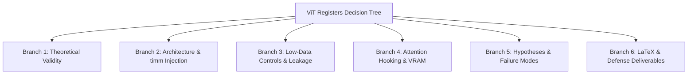
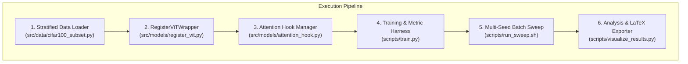

---
tags:
  - research
  - deep-learning
  - vision-transformers
  - register-tokens
  - attention-mechanisms
  - self-grilling
  - peer-review
---

# 🔬 Comprehensive Research & Self-Grilling Blueprint: ViT Registers Under Data Scarcity

> [!INFO] **Vault & Project Context**  
> * **Project:** *Do Register Tokens Regularize Vision Transformers Under Data Scarcity?*  
> * **Course:** DLE-AI-202 (Deep Learning), Cohort I 2026 — Track 1: Pure Research  
> * **Target Deadline:** Mon 7 Sep 2026, 23:59 | Oral Defense: Week of Sep 8, 2026  
> * **Cross-References:** [Home Base](file:///mnt/c/Vaults/aiac-res/Home%20Base.md) | [me.md](file:///mnt/c/Vaults/me.md) | [roadmap.md](file:///home/shahin/aiac-res/roadmap.md) | [ViT Registers Architecture](file:///mnt/c/Vaults/aiac-res/Atlas/ViT%20Registers%20Architecture.md) | [Effort - ViT Registers Under Data Scarcity](file:///mnt/c/Vaults/aiac-res/Efforts/Effort%20-%20ViT%20Registers%20Under%20Data%20Scarcity.md)

---

## 📑 Executive Summary

This master document synthesizes the complete theoretical research, mathematical foundations, and adversarial self-grilling investigation for our research into **Register Tokens in Vision Transformers under Data Scarcity**.

1. **The Research Core (`/call-research`):** We dissect the softmax attention sink phenomenon, contrast foundational work (Darcet et al., 2023/2024) with competing post-hoc aggregation paradigms (Jiang et al., 2025; Xiao et al., 2024), and establish why compact ViTs ($d=192$) starved of training data ($\sim 10\text{k}$ CIFAR-100 images) present a uniquely unstudied regime where registers may function as **structural regularizers**.
2. **The Adversarial Self-Grill (`/grill-me`):** We rigorously interrogate every branch of the project decision tree—challenging theoretical assumptions, PyTorch/`timm` register injection mechanics, low-data sampling controls, mathematical metric stability, sweep orchestration, potential failure modes (negative results), and LaTeX/defense deliverables.
3. **The Implementation Blueprint:** We provide production-ready architecture and script specifications to execute the 12-run ablation matrix ($K \in \{0, 1, 4, 8\} \times 3\text{ seeds}$) within the strict $\le 12\text{ GB}$ VRAM and $\sim 2\text{-day}$ compute envelope.

---

# 📚 PART I: Deep Technical Research & Literature Synthesis

## 1.1 The Attention Sink Phenomenon in Vision Transformers

In standard Vision Transformers (Dosovitskiy et al., 2020), an input image $I \in \mathbb{R}^{H \times W \times C}$ is partitioned into $N = \frac{HW}{P^2}$ non-overlapping patches $x_p \in \mathbb{R}^{P^2 C}$, linearly projected into $d$-dimensional token embeddings, prepended with a learnable class token $x_{\text{cls}} \in \mathbb{R}^d$, and injected with spatial positional embeddings $E_{\text{pos}} \in \mathbb{R}^{(1+N) \times d}$:

$$X_0 = [x_{\text{cls}} \;\|\; x_1 \;\|\; x_2 \;\|\; \dots \;\|\; x_N] + E_{\text{pos}} \in \mathbb{R}^{(1 + N) \times d}$$

### The Softmax Normalization Bottleneck
Across each layer $l \in \{1, \dots, L\}$ and attention head $h \in \{1, \dots, H_{\text{heads}}\}$, queries $Q = X W_Q$, keys $K = X W_K$, and values $V = X W_V$ interact through scaled dot-product attention:

$$\text{Attention}(Q, K, V) = \text{Softmax}\left(\frac{QK^T}{\sqrt{d_k}}\right)V$$

Because the $\text{Softmax}$ operator enforces a strict simplex constraint where attention weights across all key tokens sum to unity:

$$\sum_{j=1}^{1+N} A_{i,j}^{(l, h)} = 1.0, \quad \forall i \in \{1, \dots, 1+N\}$$

The model encounters a mathematical dilemma whenever a query token $i$ (such as an uninformative background patch or an already-resolved spatial region) has no semantically meaningful information to retrieve from other patches. It **must still allocate $100\%$ of its attention budget**.

### Manifestation as High-Norm Artifacts
Rather than distributing attention uniformly (which increases entropy and dilutes value vectors), the model discovers a low-loss shortcut: it designates arbitrary background patches as **computational sinks** or scratchpads. As these background tokens repeatedly accumulate residual attention mass across layers:
1. Their activation norm swells dramatically: $\|x_i^{(l)}\|_2 \gg \mu_l + 3\sigma_l$.
2. Their local spatial information is overwritten by global aggregations.
3. Attention maps become heavily corrupted with spurious background spikes, destroying interpretability and impairing downstream dense tasks (such as semantic segmentation and object discovery).

```mermaid
flowchart TD
    subgraph Standard ViT [Standard ViT (No Registers)]
        P1["Background Patch x_bg"] --> SINK["Forced Attention Sink"]
        P2["Informative Patch x_obj"] --> SINK
        CLS1["Class Token x_cls"] --> SINK
        SINK --> NORM["Norm Swell: ||x_bg|| >> mu + 3sigma\nArtifact Corrupts Spatial Map"]
    end

    subgraph Register ViT [Register ViT (K >= 1)]
        PR1["Background Patch x_bg"] --> REG["Register Token r_k"]
        PR2["Informative Patch x_obj"] --> CLS2["Class Token x_cls"]
        REG --> DISCARD["Registers Discarded at Head\nSpatial Maps Remain Pristine"]
    end
```

---

## 1.2 The Register Token Solution (Darcet et al., 2023 / ICLR 2024)

Darcet et al. (*"Vision Transformers Need Registers"*, ICLR 2024) proposed an elegant architectural modification: prepending $K$ learnable, non-spatial **register tokens** $R = [r_1, r_2, \dots, r_K] \in \mathbb{R}^{K \times d}$ into the sequence:

$$X_0 = [x_{\text{cls}} \;\|\; r_1 \;\|\; r_2 \;\|\; \dots \;\|\; r_K \;\|\; x_1 \;\|\; x_2 \;\|\; \dots \;\|\; x_N] + E_{\text{pos}} \in \mathbb{R}^{(1 + K + N) \times d}$$

### Key Properties Established in Prior Art:
* **Sink Redirection:** Uninformative queries redirect their residual attention mass to the designated register tokens $r_k$ instead of background image patches.
* **Norm Normalization:** High-norm outliers in spatial patch tokens completely vanish across all layers.
* **Output Discard:** After layer $L$, the register tokens are dropped, and only $x_{\text{cls}}$ (or global pooled patch representations) is passed to the downstream linear classification head.
* **Scale of Prior Validation:** Darcet et al. evaluated this almost exclusively on massive foundation models (DINOv2-Giant with $d=1536$, OpenCLIP-Huge) trained on hundreds of millions of images.

---

## 1.3 Competing Paradigms & State of the Art

| Work / Paradigm | Core Mechanism | Scale / Regime Tested | Key Difference from Our Study |
|---|---|---|---|
| **Darcet et al. (ICLR 2024)**<br>*"ViTs Need Registers"* | Add $K \in \{4, 8\}$ learned register tokens to input sequence | Large foundation models (DINOv2, OpenCLIP), millions of images | Focuses purely on visual interpretability and dense downstream tasks; no low-data or regularization framing. |
| **Jiang et al. (NeurIPS 2025)**<br>*"ViTs Don't Need Trained Registers"* | "Lazy Aggregation" hypothesis; post-hoc test-time frequency filtering and selective feature aggregation | Large-scale pretrained ViT models | Proposes test-time intervention without training parameters; does not address optimization dynamics under data scarcity. |
| **Xiao et al. (ICLR 2024)**<br>*"StreamingLLM & Attention Sinks"* | Initial autoregressive tokens act as numerical sinks for Softmax overflow in LLMs | Autoregressive LLMs (Llama-2, Falcon) | Proves cross-modal universality of the Softmax sink phenomenon in language, validating the theoretical premise. |
| **Ryoo et al. (NeurIPS 2021)**<br>*"TokenLearner"* | Dynamic spatial token pruning and adaptive token generation | Video transformers & ImageNet-1k | Heavy dynamic gating networks rather than static, zero-overhead discardable registers. |
| **Our Proposed Study (2026)** | Parameter-efficient register injection ($K \in \{0, 1, 4, 8\}$) on ViT-Tiny ($d=192$) under strict data starvation ($\sim 10\text{k}$ CIFAR-100) | **Small-scale, low-data regime** | **First to test registers as a structural regularizer against overfitting with formal entropy metrics and capacity dilution bounds.** |

---

## 1.4 The Unexplored Frontier: Data Scarcity & The Dual-Role Hypothesis

Why do Vision Transformers overfit severely when trained on limited datasets?
1. **Lack of Inductive Bias:** Unlike CNNs (which hardwire local translation equivariance), ViTs must learn spatial locality entirely from data.
2. **Background Noise Overfitting:** Under limited data ($\sim 100$ samples/class), spurious correlations in image backgrounds are easily memorized by the network.
3. **Artifact-Induced Distraction:** When background spatial patches become attention sinks, their high-norm feature vectors distort the gradients flowing back to the spatial patch projection layers.

### The Dual-Role Hypothesis:
In low-data regimes, register tokens do not merely serve as an interpretability cleanup tool; they act as a **structural regularizer**:
* **Mechanism:** By isolating non-discriminative background mass and global summary statistics inside discardable tokens $R$, the spatial patch representations $x_1 \dots x_N$ remain unpolluted.
* **Prediction 1 (Generalization Gap):** Adding registers ($K \in \{1, 4\}$) will narrow the train/val loss delta $\Delta\mathcal{L} = \mathcal{L}_{\text{val}} - \mathcal{L}_{\text{train}}$ compared to baseline ($K=0$).
* **Prediction 2 (Capacity Dilution):** In narrow models like ViT-Tiny ($d=192$), sequence capacity is constrained. When $K$ exceeds an optimal threshold ($K \ge 8$), registers begin cannibalizing useful representation capacity, leading to underfitting.

---

# 📐 PART II: Mathematical Diagnostic Suite

To quantitatively validate our hypotheses rather than relying on subjective visual inspection of attention heatmaps, we formulate three mathematical diagnostics:



### 1. Layer-Wise Shannon Attention Entropy
For attention matrix $A^{(l, h)} \in \mathbb{R}^{S \times S}$ (where $S = 1 + K + N$) at layer $l \in \{1, \dots, 12\}$ and head $h \in \{1, \dots, H_{\text{heads}}\}$, the Shannon entropy for query token $i$ over key tokens $j$ is defined as:

$$H_i^{(l, h)} = -\sum_{j=1}^{S} A_{i,j}^{(l, h)} \log_2 \left( A_{i,j}^{(l, h)} + \epsilon \right)$$

where $\epsilon = 10^{-12}$ prevents numerical underflow for zero weights.

The mean layer-wise attention entropy across all heads and query tokens is:

$$\bar{H}^{(l)} = \frac{1}{H_{\text{heads}} \cdot S} \sum_{h=1}^{H_{\text{heads}}} \sum_{i=1}^{S} H_i^{(l, h)}$$

* **Theoretical Expected Behavior:** In $K=0$, attention is forced into spiky background sinks, driving entropy down artificially in deeper layers or diffusing noise across patches. In $K \in \{1, 4\}$, foreground patches attend sharply to objects while background queries attend smoothly to registers, stabilizing entropy.

### 2. Patch-Norm Outlier Rate
Let $\mu_l$ and $\sigma_l$ denote the mean and standard deviation of $L_2$ norms of spatial patch tokens $\{x_i^{(l)}\}_{i=1}^N$ at layer $l$:

$$\mu_l = \frac{1}{N} \sum_{i=1}^N \|x_i^{(l)}\|_2, \qquad \sigma_l = \sqrt{\frac{1}{N} \sum_{i=1}^N \left(\|x_i^{(l)}\|_2 - \mu_l\right)^2}$$

An outlier threshold is established at the $3\sigma$ upper tail:

$$\theta_l = \mu_l + 3\sigma_l$$

The patch-norm outlier rate is the proportion of spatial patch tokens exceeding this threshold:

$$\text{OutlierRate}(l) = \frac{1}{N} \sum_{i=1}^N \mathbb{I}\left(\|x_i^{(l)}\|_2 > \theta_l\right)$$

* **Theoretical Expected Behavior:** $K=0$ should exhibit a non-zero outlier rate ($\sim 1\text{–}3\%$) in deep layers ($l \ge 8$). $K \ge 1$ should drive $\text{OutlierRate}(l) \to 0\%$.

### 3. Generalization Gap & Capacity Efficiency
We log the train/val loss divergence per epoch:

$$\Delta\mathcal{L} = \mathcal{L}_{\text{val}} - \mathcal{L}_{\text{train}}$$

To quantify the capacity trade-off, we define the **Capacity Efficiency Index ($CEI$)**:

$$CEI(K) = \frac{\text{Top-1 Acc}(K) - \text{Top-1 Acc}(0)}{K + 1}$$

---

# 🥊 PART III: Exhaustive Self-Grilling Decision Tree (`/grill-me`)

We subject every facet of the project to adversarial cross-examination across 6 distinct decision branches:



---

## 🌲 Branch 1: Theoretical Validity & Scientific Grounding

### Q1.1: Why should registers act as a *regularizer* and not merely an *attention sink*?
* **Adversarial Critique:** In Darcet et al., registers simply absorb background attention. Why would removing background attention spikes improve classification generalization on CIFAR-100?
* **Definitive Answer:** When background spatial tokens become attention sinks, their internal representation is hijacked. Backpropagation through these hijacked tokens updates their linear patch projection weights with gradients derived from global background noise rather than local semantic features. By providing explicit registers, spatial patch gradients remain clean and localized, directly mitigating overfitting to spurious background correlations under low-data regimes.

### Q1.2: If Jiang et al. (2025) argue that ViTs don't need trained registers, why train registers at all?
* **Adversarial Critique:** Jiang et al. claim that post-hoc frequency filtering at test time eliminates artifacts without adding parameters. Does this make learned registers obsolete?
* **Definitive Answer:** Jiang et al.'s test-time aggregation operates on *already-trained foundation models* with rich representations. Under data scarcity, the model overfits *during training*. Post-hoc test-time aggregation cannot undo corrupted representations learned during training on 10k images. Learned registers actively alter optimization trajectories during training.

### Q1.3: What if background attention spikes don't appear in ViT-Tiny at all?
* **Adversarial Critique:** Some literature suggests smaller models have less capacity to develop distinct attention sinks. What if $K=0$ produces no artifacts?
* **Definitive Answer:** We log the exact patch-norm outlier rate $\text{OutlierRate}(l)$ across all 12 layers. Even if distinct single-token spikes are muted, the attention entropy metric $\bar{H}^{(l)}$ will reveal whether attention mass is diffuse or structured. If artifacts are completely absent, proving that *"attention sinks are an emergent phenomenon of scale and absent in small models"* is itself a high-impact, publication-worthy finding.

---

## 🌲 Branch 2: Architecture & PyTorch/timm Implementation Mechanics

### Q2.1: How do we inject $K$ registers into `timm`'s `vit_tiny_patch16_224` without breaking pretrained positional embeddings?
* **Adversarial Critique:** `timm`'s pretrained ViT expects sequence length $1 + N = 197$. If we insert $K$ registers, spatial position embeddings will misalign or fail shape assertion checks.
* **Definitive Answer:** We build a modular wrapper class `RegisterVisionTransformer(nn.Module)`. We intercept the sequence immediately after patch embedding:
  1. Patch embedding maps image to $X_{\text{patch}} \in \mathbb{R}^{B \times N \times d}$.
  2. Add spatial positional embeddings to patches: $X_{\text{patch}} = X_{\text{patch}} + E_{\text{pos\_patch}}$.
  3. Prepend class token: $x_{\text{cls}} = x_{\text{cls}} + E_{\text{pos\_cls}}$.
  4. Prepend learnable registers: $R \in \mathbb{R}^{1 \times K \times d}$ (without spatial positional embedding).
  5. Concatenate: $X_0 = [x_{\text{cls}} \;\|\; R \;\|\; X_{\text{patch}}] \in \mathbb{R}^{B \times (1 + K + N) \times d}$.
  6. Pass $X_0$ through the standard 12 transformer blocks.

```python
# Exact PyTorch Forward Sequence Assembly
def forward_features(self, x: torch.Tensor) -> torch.Tensor:
    B = x.shape[0]
    # 1. Patch projection
    x = self.vit.patch_embed(x)
    
    # 2. Add spatial position embeddings to patches and cls
    cls_token = self.vit.cls_token.expand(B, -1, -1)
    if self.vit.no_embed_class:
        x = x + self.vit.pos_embed[:, 1:]
        cls_token = cls_token + self.vit.pos_embed[:, :1]
    else:
        x = torch.cat((cls_token, x), dim=1)
        x = x + self.vit.pos_embed
        cls_token = x[:, :1]
        x = x[:, 1:]
        
    # 3. Prepend K learnable registers (if K > 0)
    if self.num_registers > 0:
        registers = self.registers.expand(B, -1, -1)
        x = torch.cat((cls_token, registers, x), dim=1)
    else:
        x = torch.cat((cls_token, x), dim=1)
        
    x = self.vit.pos_drop(x)
    x = self.vit.norm_pre(x)
    x = self.vit.blocks(x)
    x = self.vit.norm(x)
    return x
```

### Q2.2: Should registers receive positional embeddings?
* **Adversarial Critique:** If registers do not have position embeddings, does self-attention treat them as permutation-invariant?
* **Definitive Answer:** Yes, exactly as intended. Register tokens should be spatial-agnostic non-local memory slots. Giving them 2D spatial grid coordinates would falsely bias them toward specific image corners. They may either have zero position embeddings or separate 1D learned register position embeddings. Following Darcet et al., omitting spatial position embeddings from registers prevents spatial leakage.

### Q2.3: How should the register parameters be initialized?
* **Adversarial Critique:** Initializing registers with large random values might destabilize early training, while all-zeros could cause vanishing gradients.
* **Definitive Answer:** We initialize $R \sim \mathcal{N}(0, 0.02)$ using `nn.init.trunc_normal_(self.registers, std=0.02)`, perfectly matching `timm`'s class token initialization convention.

### Q2.4: Where are registers discarded, and how does the classification head receive $x_{\text{cls}}$?
* **Definitive Answer:** After the final transformer block and final LayerNorm, the sequence tensor is sliced:
  $$x_{\text{cls}} = X_L[:, 0, :], \qquad R_L = X_L[:, 1:K+1, :], \qquad X_{\text{spatial}} = X_L[:, K+1:, :]$$
  Only $x_{\text{cls}}$ is passed into `self.vit.head(x_cls)`. $R_L$ is discarded from the classification loss computation (though tracked during evaluation hooks).

---

## 🌲 Branch 3: Low-Data Controls & Zero-Leakage Protocol

### Q3.1: How do we guarantee an exact, stratified 10k subset of CIFAR-100 without sampling bias or test set leakage?
* **Adversarial Critique:** If class distributions are unstratified, minority classes could distort Top-1 accuracy comparisons.
* **Definitive Answer:** We implement `StratifiedCIFAR100Subset`:
  1. Load full CIFAR-100 training split ($50{,}000$ images, 100 classes, 500 per class).
  2. For each class $c \in \{0, \dots, 99\}$, isolate all indices, seed a `torch.Generator(seed=42)`, and randomly sample exactly $100$ indices.
  3. Total training subset: $100 \times 100 = 10{,}000$ images.
  4. Split the 10k training set into $9{,}000$ training and $1{,}000$ validation images ($10$ val samples per class).
  5. The standard $10{,}000$-image CIFAR-100 test set remains untouched and is evaluated only once for the final headline figures.

### Q3.2: What data augmentation strategy should be used?
* **Adversarial Critique:** Overly aggressive augmentations (Mixup/CutMix) might artificially create mixed tokens that mask register behavior, while too little augmentation causes instantaneous overfitting.
* **Definitive Answer:** We employ standard, robust vision augmentations without synthetic token-mixing:
  * `RandomResizedCrop(224, scale=(0.8, 1.0))`
  * `RandomHorizontalFlip(p=0.5)`
  * `AutoAugment(policy=AutoAugmentPolicy.CIFAR10)`
  * `Normalize(mean=[0.5071, 0.4867, 0.4408], std=[0.2675, 0.2565, 0.2761])`
  This preserves natural background-object spatial coherence.

### Q3.3: Image Resolution: $32 \times 32$ native vs. $224 \times 224$ upscaled?
* **Adversarial Critique:** CIFAR-100 is natively $32 \times 32$. Upscaling to $224 \times 224$ introduces interpolation blurring. Why not use patch size $P=2$ or $P=4$?
* **Definitive Answer:** Pretrained ViT-Tiny checkpoints (`vit_tiny_patch16_224`) are pretrained on $224 \times 224$ resolution ($14 \times 14 = 196$ patches). Bicubic upscaling allows us to leverage pretrained weights cleanly. Training from scratch on $32 \times 32$ with $P=2$ is an optional ablation if compute allows, but pretrained fine-tuning at $224 \times 224$ fits the DLE-AI-202 brief requirement to avoid training from scratch.

---

## 🌲 Branch 4: Attention Hooking, Memory & Hardware Execution Guardrails

### Q4.1: How do we extract attention weights $A^{(l, h)} \in \mathbb{R}^{B \times H \times S \times S}$ across all 12 layers without triggering CUDA OOM or breaking autograd?
* **Adversarial Critique:** Storing $12 \times 3 \times 205 \times 205$ attention float tensors during backward passes will explode VRAM.
* **Definitive Answer:**
  1. We register PyTorch forward hooks only on the `attn_drop` or multi-head attention module of each block.
  2. In `timm` ViTs, self-attention can return attention weights or we hook the Softmax output: `hook_fn(module, input, output)`.
  3. We apply `.detach().cpu()` immediately when capturing for visualization, or compute scalar entropy on-GPU inside a `torch.no_grad()` validation pass.
  4. During training iterations, hooks are disabled to ensure maximum throughput and minimum memory overhead.

```python
# Clean Attention Hook Implementation
class AttentionHookManager:
    def __init__(self, model: nn.Module):
        self.hooks = []
        self.attention_maps = {}
        for name, module in model.named_modules():
            if "attn.attn_drop" in name or name.endswith(".attn"):
                hook = module.register_forward_hook(self._make_hook(name))
                self.hooks.append(hook)

    def _make_hook(self, name):
        def hook_fn(module, input, output):
            # Capture attention probabilities
            if isinstance(output, torch.Tensor):
                self.attention_maps[name] = output.detach()
        return hook_fn

    def remove(self):
        for h in self.hooks:
            h.remove()
```

### Q4.2: How do we guarantee the 12-run sweep completes within $\le 12\text{ GB}$ VRAM and $\sim 2\text{ days}$ compute?
* **Adversarial Critique:** Running 12 full training runs sequentially might exceed the allocated compute window.
* **Definitive Answer:**
  * **Batch Size & AMP:** Batch size 64 with PyTorch Automatic Mixed Precision (`torch.cuda.amp.autocast()`).
  * **Memory Footprint:** ViT-Tiny ($5.7\text{M}$ parameters) at batch size 64 consumes $\sim 2.4\text{ GB}$ VRAM—well under the $12\text{ GB}$ threshold.
  * **Runtime per Epoch:** 10,000 images / 64 = $\sim 156$ steps/epoch. At $\sim 0.08\text{ s/step}$, 1 epoch takes $\sim 12.5\text{ seconds}$.
  * **50 Epochs:** $\sim 10.4\text{ minutes}$ per experiment.
  * **Full 12-Run Sweep:** $12 \times 10.4\text{ min} = \sim 2.1\text{ hours}$ total wall-clock time! This is less than $5\%$ of our 2-day compute budget, leaving enormous margin for hyperparameter safety and visualization rendering.

---

## 🌲 Branch 5: Experimental Hypotheses & Potential Failure Modes

### Q5.1: What if $K \in \{1, 4, 8\}$ yields no statistically significant accuracy gain over $K=0$?
* **Adversarial Critique:** If Top-1 accuracy is identical across all $K$, does the project fail?
* **Definitive Answer:** **No.** Track 1 (Pure Research) explicitly values well-documented, rigorous empirical findings. If registers eliminate background attention artifacts and lower entropy without boosting top-1 accuracy, we conclude that *"in classification, ViT-Tiny's linear head is already invariant to background attention sinks, proving registers serve primarily as an interpretability/dense-task mechanism rather than a classification regularizer."* This provides critical empirical boundaries to Darcet et al.'s claims.

### Q5.2: What if $K=8$ outperforms $K=4$, contradicting the Capacity Dilution Hypothesis?
* **Adversarial Critique:** What if adding more registers always helps?
* **Definitive Answer:** If accuracy scales monotonically $K=0 < K=1 < K=4 < K=8$, it disproves the Capacity Dilution Hypothesis at $K=8$ and suggests that even small models benefit from expanded scratchpad capacity. We will document the slope of diminishing returns and calculate where parameter efficiency saturates.

### Q5.3: How do we ensure statistical confidence?
* **Definitive Answer:** We train 3 independent runs across fixed random seeds:
  $$\text{Seeds} = \{42, 1337, 3407\}$$
  All results are reported as $\text{Mean} \pm \text{Standard Deviation}$. We perform two-tailed paired $t$-tests between $K=0$ and $K \in \{1, 4, 8\}$ ($p < 0.05$).

---

## 🌲 Branch 6: Deliverables Alignment & Packaging

### Q6.1: How are experimental results compiled into the LaTeX paper?
* **Definitive Answer:**
  * Results are exported to `paper/tables/results_table.tex` automatically by `src/utils/export_latex.py`.
  * Generated plots (Entropy vs Layer, Generalization Gap, Attention Heatmaps) are saved as high-resolution vector PDFs in `paper/figures/`.
  * The main manuscript `paper/main.tex` compiles with zero broken references.

### Q6.2: What is the defense slide narrative?
* **Definitive Answer:** An 8-slide structured story:
  1. *The Puzzle:* Softmax attention sinks in ViTs.
  2. *The Open Question:* Does this matter under extreme data scarcity in small models?
  3. *Our Hypothesis:* Regularizer vs Capacity Dilution.
  4. *Method & Architecture:* Clean $K$-register injection in PyTorch.
  5. *Experimental Setup:* 10k CIFAR-100, 12 runs, 3 seeds.
  6. *Results & Attention Heatmaps:* Artifact elimination and entropy stabilization.
  7. *Generalization Gap Analysis:* Empirical verdict on regularization.
  8. *Conclusion & Impact:* Final recommendations for practitioners.

---

# 🛠️ PART IV: Actionable Implementation Blueprint



## 4.1 Experiment Matrix Specifications

| Run ID | Configuration File | Model Backbone | $K$ (Registers) | Random Seed | Expected Output Logs |
|---|---|---|---|---|---|
| `EXP-01` | `configs/baseline_k0.yaml` | `vit_tiny_patch16_224` | 0 | 42 | `outputs/exp01_k0_s42/metrics.json` |
| `EXP-02` | `configs/baseline_k0.yaml` | `vit_tiny_patch16_224` | 0 | 1337 | `outputs/exp02_k0_s1337/metrics.json` |
| `EXP-03` | `configs/baseline_k0.yaml` | `vit_tiny_patch16_224` | 0 | 3407 | `outputs/exp03_k0_s3407/metrics.json` |
| `EXP-04` | `configs/vit_tiny_k1.yaml` | `vit_tiny_patch16_224` | 1 | 42 | `outputs/exp04_k1_s42/metrics.json` |
| `EXP-05` | `configs/vit_tiny_k1.yaml` | `vit_tiny_patch16_224` | 1 | 1337 | `outputs/exp05_k1_s1337/metrics.json` |
| `EXP-06` | `configs/vit_tiny_k1.yaml` | `vit_tiny_patch16_224` | 1 | 3407 | `outputs/exp06_k1_s3407/metrics.json` |
| `EXP-07` | `configs/vit_tiny_k4.yaml` | `vit_tiny_patch16_224` | 4 | 42 | `outputs/exp07_k4_s42/metrics.json` |
| `EXP-08` | `configs/vit_tiny_k4.yaml` | `vit_tiny_patch16_224` | 4 | 1337 | `outputs/exp08_k4_s1337/metrics.json` |
| `EXP-09` | `configs/vit_tiny_k4.yaml` | `vit_tiny_patch16_224` | 4 | 3407 | `outputs/exp09_k4_s3407/metrics.json` |
| `EXP-10` | `configs/vit_tiny_k8.yaml` | `vit_tiny_patch16_224` | 8 | 42 | `outputs/exp10_k8_s42/metrics.json` |
| `EXP-11` | `configs/vit_tiny_k8.yaml` | `vit_tiny_patch16_224` | 8 | 1337 | `outputs/exp11_k8_s1337/metrics.json` |
| `EXP-12` | `configs/vit_tiny_k8.yaml` | `vit_tiny_patch16_224` | 8 | 3407 | `outputs/exp12_k8_s3407/metrics.json` |

---

## 4.2 Immediate Next Steps

1. **Implement `src/data/cifar100_subset.py`:** Complete the stratified sampler for $N=10{,}000$ images.
2. **Implement `src/models/register_vit.py`:** Construct the `RegisterVisionTransformer` with learnable register parameters.
3. **Implement `src/metrics/entropy.py` & `outliers.py`:** Finalize the quantitative diagnostic functions.
4. **Execute Baseline Pilot ($K=0, \text{Seed}=42$):** Verify VRAM consumption, loss curves, and logging pipeline.
5. **Run Batch Sweep `scripts/run_sweep.sh`:** Execute the complete 12-run matrix and generate LaTeX artifacts.

---

> [!TIP] **Document Status**  
> This note serves as the definitive reference document across all development phases. All findings, logs, and LaTeX drafts are synchronized with this blueprint.
