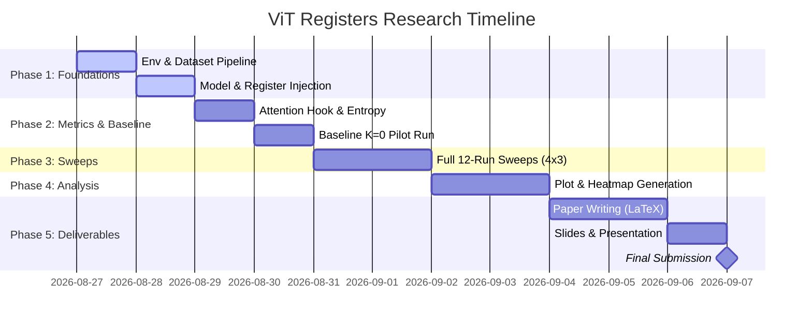

# 🗺️ Project Roadmap: ViT Registers Under Data Scarcity

> **Project:** *Do Register Tokens Regularize Vision Transformers Under Data Scarcity?*  
> **Course:** DLE-AI-202 (Deep Learning), Cohort I 2026  
> **Track:** 1 — Pure Research  
> **Final Submission Deadline:** **Mon 7 Sep 2026, 23:59**  
> **Oral Defense:** Week of Sep 8, 2026  

---

## 🎯 Executive Objective

Investigate whether adding learnable **register tokens** ($K \in \{0, 1, 4, 8\}$) to compact Vision Transformers (ViT-Tiny / ViT-Small) acts as a **structural regularizer** against overfitting when trained on a severely constrained dataset ($\sim 10\text{k}$ CIFAR-100 images). We will evaluate this quantitatively via:
1. **Classification Accuracy & Generalization Gap:** $\Delta\mathcal{L} = \mathcal{L}_{\text{val}} - \mathcal{L}_{\text{train}}$.
2. **Layer-wise Shannon Attention Entropy:** $H_i^{(l, h)} = -\sum_{j} A_{i,j}^{(l, h)} \log (A_{i,j}^{(l, h)} + \epsilon)$.
3. **Patch-Norm Outlier Rate:** Frequency of background tokens with $\|x\|_2 > \mu + 3\sigma$.

---

## 📅 Timeline & Milestone Overview



---

## 🛠️ Detailed Phase-by-Phase Plan

### 🚀 Phase 1: Environment & Pipeline Foundations (Aug 27 – Aug 29)
**Goal:** Build the modular core components for data loading and register-augmented ViTs.

- [ ] **1.1 Setup Virtual Environment:**
  - Create/activate conda environment (`Python 3.11`).
  - Install dependencies (`pip install -r requirements.txt`).
  - Verify CUDA GPU availability and memory limits.
- [ ] **1.2 Stratified Low-Data Dataset Loader (`src/data/cifar100_subset.py`):**
  - Implement a stratified sampler producing exactly 100 samples per class ($N_{\text{train}} = 10{,}000$).
  - Configure standard vision data augmentations (RandomCrop, AutoAugment/RandAugment, Normalize).
- [ ] **1.3 Register Token ViT Wrapper (`src/models/register_vit.py`):**
  - Build `RegisterVisionTransformer` wrapping `timm`'s `vit_tiny_patch16_224`.
  - Implement learnable register parameters $R \in \mathbb{R}^{K \times d}$.
  - Prepend registers: $Z_0 = [x_{\text{cls}} \;\|\; r_1 \dots r_K \;\|\; x_1 \dots x_N] + E_{\text{pos}}$.
  - Discard registers after layer 12 and pass only $x_{\text{cls}}$ to the classifier head.

---

### 🔬 Phase 2: Metrics Suite & Baseline Pilot (Aug 29 – Aug 31)
**Goal:** Implement attention weight interception, compute entropy, and verify the $K=0$ control baseline.

- [ ] **2.1 Attention Interception Hook (`src/models/attention_hook.py`):**
  - Attach forward hooks to all 12 Multi-Head Self-Attention layers to capture $A^{(l, h)} \in \mathbb{R}^{S \times S}$.
- [ ] **2.2 Quantitative Metric Library (`src/metrics/`):**
  - `entropy.py`: Calculate layer-wise Shannon entropy across heads and query tokens.
  - `outliers.py`: Compute patch feature norms and evaluate the $\mu + 3\sigma$ background outlier rate.
  - `generalization.py`: Log train/val loss differentials per epoch.
- [ ] **2.3 Training & Evaluation Harness (`scripts/train.py`, `scripts/eval.py`):**
  - Implement training loop with Automatic Mixed Precision (AMP), AdamW optimizer, and Cosine Annealing LR.
  - Log scalar metrics to JSON/CSV in `outputs/`.
- [ ] **2.4 Baseline Pilot Run ($K=0$):**
  - Run 50-epoch training of baseline ViT-Tiny on seed 42.
  - Confirm training throughput, convergence, and VRAM usage ($\le 12\text{ GB}$).

---

### ⚡ Phase 3: Multi-Seed Ablation Sweeps (Aug 31 – Sep 2)
**Goal:** Execute the full 12-experiment sweep matrix ($K \in \{0, 1, 4, 8\} \times 3\text{ seeds}$).

- [ ] **3.1 Orchestrate Batch Runner (`scripts/run_sweep.sh`):**
  - Implement automated sequential runner with fault tolerance and GPU memory clearing (`torch.cuda.empty_cache()`).
- [ ] **3.2 Run Experiment Matrix:**

| ID | Backbone | Registers ($K$) | Seed | Status |
|---|---|---|---|---|
| `EXP-01` | ViT-Tiny | 0 (Baseline) | 42 | ⏳ Pending |
| `EXP-02` | ViT-Tiny | 0 (Baseline) | 1337 | ⏳ Pending |
| `EXP-03` | ViT-Tiny | 0 (Baseline) | 2026 | ⏳ Pending |
| `EXP-04` | ViT-Tiny | 1 | 42 | ⏳ Pending |
| `EXP-05` | ViT-Tiny | 1 | 1337 | ⏳ Pending |
| `EXP-06` | ViT-Tiny | 1 | 2026 | ⏳ Pending |
| `EXP-07` | ViT-Tiny | 4 | 42 | ⏳ Pending |
| `EXP-08` | ViT-Tiny | 4 | 1337 | ⏳ Pending |
| `EXP-09` | ViT-Tiny | 4 | 2026 | ⏳ Pending |
| `EXP-10` | ViT-Tiny | 8 | 42 | ⏳ Pending |
| `EXP-11` | ViT-Tiny | 8 | 1337 | ⏳ Pending |
| `EXP-12` | ViT-Tiny | 8 | 2026 | ⏳ Pending |

- [ ] **3.3 Aggregate Metrics:**
  - Compute Mean $\pm$ Standard Deviation across seeds for each treatment arm.

---

### 📊 Phase 4: Statistical Analysis & Visualization (Sep 2 – Sep 4)
**Goal:** Transform experiment logs into publication-ready graphs and attention map heatmaps.

- [ ] **4.1 Layer-wise Attention Entropy Curves:**
  - Plot layer index ($1 \to 12$) vs. mean entropy $\bar{H}^{(l)}$ across $K \in \{0, 1, 4, 8\}$.
- [ ] **4.2 Generalization Gap & Capacity Curve:**
  - Plot register count $K$ vs. $\Delta\mathcal{L}$ to test the **Capacity Dilution Hypothesis** ($K=8$ vs $K=1, 4$).
- [ ] **4.3 Attention Map Visualizations (`scripts/visualize_attention.py`):**
  - Render side-by-side spatial heatmaps comparing $K=0$ vs. $K=4$ on sample test images.
  - Highlight the elimination of high-norm background attention spikes.

---

### 📝 Phase 5: Paper Writing & Defense Deck (Sep 4 – Sep 7)
**Goal:** Finalize academic paper manuscript in LaTeX and prepare oral defense presentation.

- [ ] **5.1 Populate LaTeX Sections (`C:\Vaults\aiac-res\paper\`):**
  - Update `04_experimental_setup.tex` and `05_results_and_analysis.tex` with empirical values and tables.
  - Embed vector figures from Phase 4 into `paper/figures/`.
- [ ] **5.2 Compile & Validate Manuscript:**
  - Verify zero LaTeX warnings/overflows and complete BibTeX citations.
- [ ] **5.3 Build Slide Deck (`C:\Vaults\aiac-res\presentation\`):**
  - Finalize 8–10 slide deck (`slides.tex` / `slides.md`) covering problem, method, results, and capacity limits.
- [ ] **5.4 Final Submission Checklist (Due Mon 7 Sep 23:59):**
  - [ ] GitHub repository clean, reproducible, and committed to `main`.
  - [ ] Compiled PDF research paper.
  - [ ] PDF slide presentation.

---

## ⚡ Immediate Next Step: Where to Start Right Now

To start immediately, execute the following three commands:

```bash
# 1. Activate conda environment
conda activate cv-analysis # or create aiac-res

# 2. Verify dependencies
pip install -r requirements.txt

# 3. Create the data loader and test on CIFAR-100
python -c "import torch, timm; print('PyTorch:', torch.__version__, '| CUDA Available:', torch.cuda.is_available())"
```
