# 📦 Team Task Package: Shahin — Core Architecture & Training Engine

**Assignee:** Shahin  
**Role:** Core Architecture & Training Engine Lead  
**Target Code Files:**
* `src/models/register_vit.py`
* `scripts/train.py`
* `scripts/eval.py`  
**Target Delivery:** Tuesday, 1 September 2026  
**Cross-References:** [Team Task Division](file:///home/shahin/aiac-res/team_task_division.md) | [Architecture Note](file:///mnt/c/Vaults/aiac-res/Atlas/ViT%20Registers%20Architecture.md) | [Compute Budget](file:///home/shahin/aiac-res/compute_request_and_budget.md)  

---

## 🎯 1. Mission & Scientific Context

Vision Transformers (Dosovitskiy et al., 2020) lack convolutional inductive biases (translational equivariance) and severely overfit in low-data regimes. Darcet et al. (ICLR 2024) introduced **register tokens** to eliminate background attention artifacts in large foundation models.

Your mission is to build the core model wrapper and unified training engine to test whether register tokens act as a **structural regularizer** on compact ViTs (`vit_tiny_patch16_224`, $d=192$, 12 layers) trained under extreme data scarcity.

Key Responsibilities:
1. **`RegisterVisionTransformer` Module (`src/models/register_vit.py`):** Prepend $K \in \{0, 1, 4, 8\}$ learnable register tokens to the token sequence after patch projection and positional embedding injection, then discard the registers before the classification head.
2. **Unified Training Loop (`scripts/train.py`):** Production-ready PyTorch training loop supporting Automatic Mixed Precision (AMP), AdamW optimizer with cosine learning rate schedule, gradient clipping, checkpoint serialization, and structured JSON metrics export.
3. **Evaluation & Verification Harness (`scripts/eval.py`):** Model inference runner computing Top-1/Top-5 accuracy and triggering Narmina's attention hooks for layerwise entropy calculation.

---

## 📐 2. Architecture & Forward Pass Mechanics

```mermaid
flowchart LR
    Img["Input Image (3, 224, 224)"] --> Patch["Patch Embed (196, 192)"]
    Patch --> AddPos["Add Pos Embed + CLS"]
    AddPos --> CatReg["Concat K Register Tokens: [CLS || R_1..K || Patches]"]
    CatReg --> Blocks["12x Transformer Blocks (MHSA + MLP)"]
    Blocks --> Discard["Discard Registers (Slice CLS: X[:, 0, :])"]
    Discard --> Head["Linear Classifier (100 Classes)"]
    Head --> Output["Class Logits (Batch, 100)"]
```



### Mathematical Sequence Formulation:
1. **Patch Projection & Positional Embedding:**
   $$X_{\text{patch}} = \text{PatchEmbed}(I) + E_{\text{pos\_patch}} \in \mathbb{R}^{B \times 196 \times d}$$
   $$x_{\text{cls}} = x_{\text{cls\_param}} + E_{\text{pos\_cls}} \in \mathbb{R}^{B \times 1 \times d}$$
2. **Register Token Prepending:**
   $$R = [r_1, r_2, \dots, r_K] \in \mathbb{R}^{1 \times K \times d}$$
   $$X_0 = [x_{\text{cls}} \;\|\; R \;\|\; X_{\text{patch}}] \in \mathbb{R}^{B \times (1 + K + 196) \times d}$$
   *(Note: Registers do not receive spatial positional embeddings, ensuring they remain non-spatial).*
3. **Transformer Processing:**
   $$X_L = \text{TransformerBlocks}_{1 \dots 12}(X_0) \in \mathbb{R}^{B \times (1 + K + 196) \times d}$$
4. **Register Discard & Classification:**
   $$x_{\text{cls\_final}} = \text{LayerNorm}(X_L[:, 0, :]) \in \mathbb{R}^{B \times d}$$
   $$\hat{y} = \text{LinearHead}(x_{\text{cls\_final}}) \in \mathbb{R}^{B \times 100}$$

---

## 💻 3. Implementation Blueprint

### 1. `RegisterVisionTransformer` (`src/models/register_vit.py`)

```python
import torch
import torch.nn as nn
import timm

class RegisterVisionTransformer(nn.Module):
    """
    Wraps a timm Vision Transformer to inject K learnable register tokens.
    """
    def __init__(
        self,
        model_name: str = "vit_tiny_patch16_224",
        num_classes: int = 100,
        num_registers: int = 0,
        pretrained: bool = True,
        drop_rate: float = 0.0,
        attn_drop_rate: float = 0.0
    ):
        super().__init__()
        self.num_registers = num_registers
        
        # Load base backbone from timm
        self.base_model = timm.create_model(
            model_name,
            pretrained=pretrained,
            num_classes=num_classes,
            drop_rate=drop_rate,
            attn_drop_rate=attn_drop_rate
        )
        self.embed_dim = self.base_model.embed_dim

        # Add learnable register parameters
        if self.num_registers > 0:
            self.registers = nn.Parameter(torch.zeros(1, num_registers, self.embed_dim))
            # Truncated normal initialization (std=0.02)
            nn.init.trunc_normal_(self.registers, std=0.02)
        else:
            self.register_parameter('registers', None)

    def forward_features(self, x: torch.Tensor) -> torch.Tensor:
        # Patch embedding + positional embedding
        x = self.base_model.patch_embed(x)
        x = self.base_model._pos_embed(x) # [B, 1 + 196, d]

        if self.num_registers > 0:
            cls_token = x[:, :1, :]
            patch_tokens = x[:, 1:, :]
            reg_tokens = self.registers.expand(x.shape[0], -1, -1)
            # Compose sequence: [CLS || Registers || Patches]
            x = torch.cat([cls_token, reg_tokens, patch_tokens], dim=1) # [B, 1 + K + 196, d]

        x = self.base_model.norm_pre(x)
        x = self.base_model.blocks(x)
        x = self.base_model.norm(x)
        return x

    def forward(self, x: torch.Tensor) -> torch.Tensor:
        x = self.forward_features(x)
        # Discard registers and patch tokens, extract only [CLS]
        cls_out = x[:, 0]
        logits = self.base_model.head(cls_out)
        return logits
```

### 2. Training Loop (`scripts/train.py`)

```python
# Key Training Hyperparameters:
# Optimizer: AdamW(lr=5e-4, weight_decay=0.05, betas=(0.9, 0.999))
# Scheduler: Linear Warmup (5 epochs) + CosineAnnealingLR (T_max=45, eta_min=1e-5)
# Loss: CrossEntropyLoss(label_smoothing=0.1)
# AMP: torch.cuda.amp.autocast(dtype=torch.float16) + GradScaler()
# Grad Clip: torch.nn.utils.clip_grad_norm_(model.parameters(), max_norm=1.0)
```

---

## ⚠️ 4. Critical Implementation Traps

1. **Positional Embedding Misalignment:** If you concatenate registers *before* `base_model._pos_embed(x)`, the learned spatial position embeddings will shift by $K$ tokens, corrupting spatial patch coordinates!
   * *Rule:* Always apply `_pos_embed` to `[CLS || Patches]`, and *then* insert registers between `CLS` and `Patches`.
2. **Head Token Slicing:** When $K > 0$, the spatial patches are at index `1 + K` onward. But the `[CLS]` token is always at index `0`. Never use `x[:, 0:1]` without squeezing, and never take `x.mean(dim=1)` as the pooled token when registers exist.
3. **Register Initialization Collapse:** Initializing registers with `torch.zeros()` without noise causes zero-gradient flatlines in layer 1 attention. Always use truncated normal: `nn.init.trunc_normal_(self.registers, std=0.02)`.
4. **AMP Scaler Step Underflow:** When using FP16 AMP, gradient clipping must be executed *after* `scaler.unscale_(optimizer)` and *before* `scaler.step(optimizer)`.

---

## ✅ 5. Definition of Done & Verification Test

Your deliverable is complete when the following test script executes without error:

```bash
python -c "
import torch
from src.models.register_vit import RegisterVisionTransformer

for k in [0, 1, 4, 8]:
    model = RegisterVisionTransformer(model_name='vit_tiny_patch16_224', num_classes=100, num_registers=k, pretrained=False)
    dummy_input = torch.randn(2, 3, 224, 224)
    logits = model(dummy_input)
    assert logits.shape == (2, 100), f'Failed for K={k}, shape was {logits.shape}'
    print(f'Verified K={k}: Output Logits Shape = {logits.shape}')
"
```
