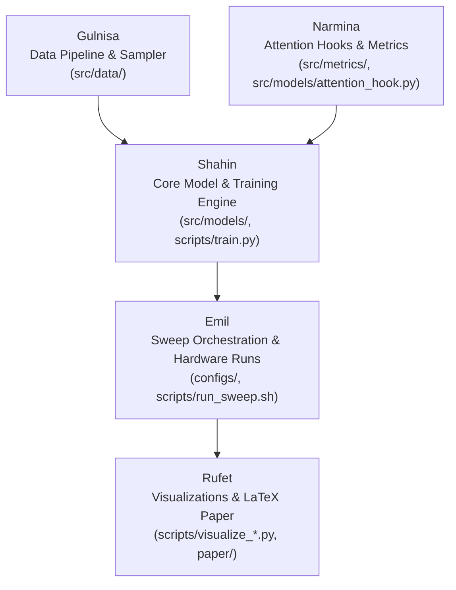
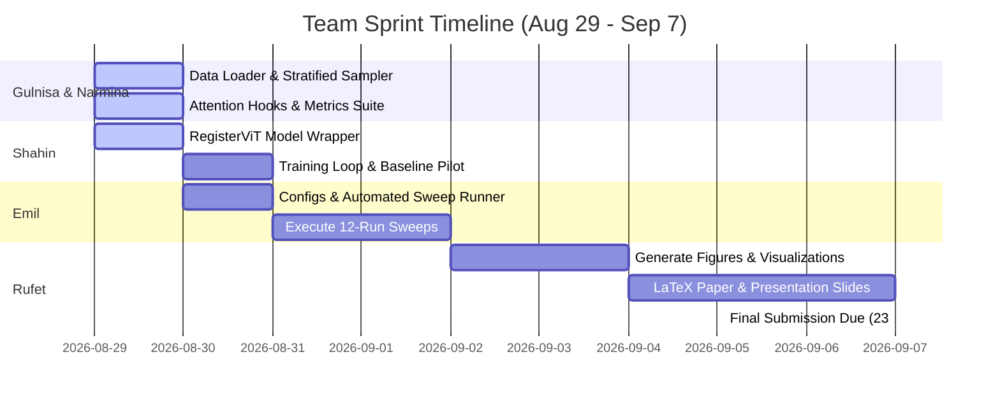

---
tags:
  - project-management
  - task-division
  - deep-learning
  - research
  - cohort-2026
---

# 👥 Team Task Division & Execution Plan: ViT Registers Research

> [!INFO] **Project Context**  
> * **Project:** *Do Register Tokens Regularize Vision Transformers Under Data Scarcity?*  
> * **Course:** DLE-AI-202 (Deep Learning), Cohort I 2026 — Track 1: Pure Research  
> * **Submission Deadline:** **Mon 7 Sep 2026, 23:59** | Oral Defense: Week of Sep 8, 2026  
> * **Compute Envelope:** ~2 days GPU window, $\le 12\text{ GB}$ peak VRAM, Automatic Mixed Precision (AMP)  
> * **Codebase Workspace:** `/home/shahin/aiac-res/` | **Vault Root:** `C:/Vaults/aiac-res/`  
> * **Cross-References:** [Roadmap](file:///home/shahin/aiac-res/roadmap.md) | [Research & Grilling Analysis](file:///home/shahin/aiac-res/research_and_grill_analysis.md) | [ViT Registers Architecture](file:///mnt/c/Vaults/aiac-res/Atlas/ViT%20Registers%20Architecture.md)

---

## 📊 1. Team Responsibility & Ownership Matrix



| Member | Primary Ownership | Assigned Code & Files | Core Deliverable | Target Delivery |
|---|---|---|---|---|
| **Gulnisa** | **Data Engineering & Low-Data Pipeline** | `src/data/cifar100_subset.py`<br>`src/data/__init__.py` | Stratified 10k CIFAR-100 loader (100 samples/class) + augmentations | **Sun 30 Aug, 14:00** |
| **Narmina** | **Diagnostic Metrics & Attention Hooks** | `src/models/attention_hook.py`<br>`src/metrics/entropy.py`<br>`src/metrics/outliers.py`<br>`src/metrics/generalization.py` | Shannon entropy, patch-norm outlier rate ($\mu + 3\sigma$), and forward hooks | **Sun 30 Aug, 16:00** |
| **Shahin** | **Core Architecture & Training Engine** | `src/models/register_vit.py`<br>`scripts/train.py`<br>`scripts/eval.py` | `RegisterVisionTransformer` wrapper ($K \in \{0, 1, 4, 8\}$) + AMP training loop | **Sun 30 Aug, 18:00** |
| **Emil** | **Ablation Sweeps & Execution Harness** | `scripts/run_sweep.sh`<br>`configs/*.yaml`<br>`src/utils/logger.py` | Automated 12-run sweep runner ($4 \times 3$ seeds) + GPU VRAM safety | **Mon 31 Aug, 12:00** |
| **Rufet** | **Analysis, Visualizations & LaTeX Paper** | `scripts/visualize_attention.py`<br>`scripts/plot_metrics.py`<br>`paper/sections/*.tex`<br>`presentation/slides.md` | Heatmap generation, entropy curves, and LaTeX manuscript integration | **Mon 31 Aug, 18:00** |

---

## 📋 2. Detailed Task Packages per Member

---

### 1️⃣ Gulnisa — Data Engineering & Low-Data Pipeline

* **Role:** Lead Data Engineer  
* **Target Files:**
  * [`src/data/cifar100_subset.py`](file:///home/shahin/aiac-res/src/data/cifar100_subset.py)
  * [`src/data/__init__.py`](file:///home/shahin/aiac-res/src/data/__init__.py)
* **Context & Objectives:**  
  Our study investigates ViTs under extreme data scarcity. We need an exact, stratified subset of CIFAR-100 containing exactly 100 images per class (10,000 total images). This must be strictly controlled with random seeds to ensure 100% reproducibility and zero data leakage.

#### Concrete Tasks:
1. **Implement `StratifiedCIFAR100Subset` Dataset Class:**
   * Load CIFAR-100 via `torchvision.datasets.CIFAR100(root='./data', train=True, download=True)`.
   * For each class $c \in \{0, \dots, 99\}$, extract image indices and randomly sample exactly 100 samples using a fixed `torch.Generator().manual_seed(seed)`.
   * Partition the 10,000 images into:
     * **Training Split:** 9,000 images (90 samples per class).
     * **Validation Split:** 1,000 images (10 samples per class).
   * Ensure standard CIFAR-100 test set ($10{,}000$ images) is loaded separately for final evaluation.
2. **Configure Data Augmentations:**
   * **Training Transform:**
     * `transforms.RandomResizedCrop(224, scale=(0.8, 1.0), interpolation=InterpolationMode.BICUBIC)`
     * `transforms.RandomHorizontalFlip(p=0.5)`
     * `transforms.AutoAugment(policy=AutoAugmentPolicy.CIFAR10)`
     * `transforms.ToTensor()`
     * `transforms.Normalize(mean=[0.5071, 0.4867, 0.4408], std=[0.2675, 0.2565, 0.2761])`
   * **Validation / Test Transform:**
     * `transforms.Resize(224, interpolation=InterpolationMode.BICUBIC)`
     * `transforms.CenterCrop(224)`
     * `transforms.ToTensor()`
     * `transforms.Normalize(mean=[0.5071, 0.4867, 0.4408], std=[0.2675, 0.2565, 0.2761])`
3. **Expose Main Loader Function:**
   ```python
   def get_cifar100_loaders(data_dir: str = "./data", batch_size: int = 64, samples_per_class: int = 100, seed: int = 42, num_workers: int = 4):
       """Returns (train_loader, val_loader, test_loader)."""
   ```
* **Definition of Done:** Running `python src/data/cifar100_subset.py` prints:
  * `Train batches: 141 (9,000 samples)`
  * `Val batches: 16 (1,000 samples)`
  * `Test batches: 157 (10,000 samples)`
  * Batch tensor shape `torch.Size([64, 3, 224, 224])` with verified balanced class distributions.

---

### 2️⃣ Narmina — Diagnostic Metrics Suite & Attention Hooks

* **Role:** Lead Metrics & Interpretability Engineer  
* **Target Files:**
  * [`src/models/attention_hook.py`](file:///home/shahin/aiac-res/src/models/attention_hook.py)
  * [`src/metrics/entropy.py`](file:///home/shahin/aiac-res/src/metrics/entropy.py)
  * [`src/metrics/outliers.py`](file:///home/shahin/aiac-res/src/metrics/outliers.py)
  * [`src/metrics/generalization.py`](file:///home/shahin/aiac-res/src/metrics/generalization.py)
  * [`src/metrics/__init__.py`](file:///home/shahin/aiac-res/src/metrics/__init__.py)
* **Context & Objectives:**  
  Subjective visual inspection of attention maps is insufficient for a Pure Research paper. We require mathematically rigorous metrics to prove that registers eliminate high-norm artifacts and stabilize attention distributions across layers.

#### Concrete Tasks:
1. **Attention Hook Manager (`src/models/attention_hook.py`):**
   * Register non-invasive forward hooks on all 12 Multi-Head Self-Attention layers in ViT.
   * Intercept attention weight matrices $A^{(l, h)} \in \mathbb{R}^{B \times H_{\text{heads}} \times S \times S}$ (where $S = 1 + K + N$).
   * Implement safe memory handling: detach tensors immediately and provide `.clear()` / `.remove()` hooks to prevent CUDA OOM.
2. **Layer-wise Shannon Attention Entropy (`src/metrics/entropy.py`):**
   * Implement formula:
     $$H_i^{(l, h)} = -\sum_{j=1}^{S} A_{i,j}^{(l, h)} \log_2 \left( A_{i,j}^{(l, h)} + 10^{-12} \right)$$
   * Compute mean layer-wise entropy $\bar{H}^{(l)}$ across heads and query tokens:
     ```python
     def compute_layerwise_entropy(attention_maps: Dict[int, torch.Tensor]) -> Dict[int, float]:
         """Computes mean Shannon entropy per layer l in [1..12]."""
     ```
3. **Patch-Norm Outlier Rate (`src/metrics/outliers.py`):**
   * Extract intermediate patch token activations $X_{\text{patch}}^{(l)} \in \mathbb{R}^{N \times d}$.
   * Compute token $L_2$ norms $\|x_i^{(l)}\|_2$, mean $\mu_l$, and standard deviation $\sigma_l$.
   * Evaluate outlier rate based on the $3\sigma$ upper bound:
     $$\theta_l = \mu_l + 3\sigma_l, \qquad \text{OutlierRate}(l) = \frac{1}{N} \sum_{i=1}^N \mathbb{I}\left(\|x_i^{(l)}\|_2 > \theta_l\right)$$
4. **Generalization Gap (`src/metrics/generalization.py`):**
   * Compute $\Delta\mathcal{L} = \mathcal{L}_{\text{val}} - \mathcal{L}_{\text{train}}$ and track convergence curves per epoch.
* **Definition of Done:** Running `python src/metrics/entropy.py` on dummy attention tensors returns layer-by-layer float values and passes automated unit tests without NaN or Inf values.

---

### 3️⃣ Shahin — Core Architecture & Training Engine

* **Role:** Core Architecture & Integration Lead  
* **Target Files:**
  * [`src/models/register_vit.py`](file:///home/shahin/aiac-res/src/models/register_vit.py)
  * [`scripts/train.py`](file:///home/shahin/aiac-res/scripts/train.py)
  * [`scripts/eval.py`](file:///home/shahin/aiac-res/scripts/eval.py)
* **Context & Objectives:**  
  Build the register token wrapper on top of `timm` Vision Transformers and establish the unified training/evaluation engine with Automatic Mixed Precision (AMP).

#### Concrete Tasks:
1. **Build `RegisterVisionTransformer` Module (`src/models/register_vit.py`):**
   * Base backbone: `timm.create_model('vit_tiny_patch16_224', pretrained=True, num_classes=100)`.
   * Add learnable register parameter: `self.registers = nn.Parameter(torch.zeros(1, num_registers, embed_dim))`.
   * Initialize with truncated normal: `nn.init.trunc_normal_(self.registers, std=0.02)`.
   * Forward logic:
     * Project patches: $X_{\text{patch}} = \text{patch\_embed}(I) + E_{\text{pos\_patch}}$.
     * Class token: $x_{\text{cls}} = x_{\text{cls}} + E_{\text{pos\_cls}}$.
     * Concatenate: $X_0 = [x_{\text{cls}} \;\|\; R \;\|\; X_{\text{patch}}] \in \mathbb{R}^{B \times (1 + K + N) \times d}$.
     * Pass through 12 Transformer blocks + final LayerNorm.
     * Slice and discard registers: feed only $x_{\text{cls}} = X_L[:, 0, :]$ to classification head `self.head(x_cls)`.
2. **Unified Training Loop (`scripts/train.py`):**
   * Load parameters dynamically from YAML config files (`configs/*.yaml`).
   * Optimizer: AdamW ($lr=5\times 10^{-4}$, weight decay $0.05$).
   * LR Scheduler: Linear warmup (5 epochs) + Cosine Annealing to minimum $lr=10^{-5}$.
   * Training features: PyTorch AMP (`torch.cuda.amp.autocast()`, `GradScaler()`), Gradient Clipping ($1.0$).
   * Save best model checkpoints and write step metrics to `outputs/<experiment_name>/metrics.json`.
3. **Evaluation Script (`scripts/eval.py`):**
   * Evaluate Top-1 accuracy, Top-5 accuracy, loss, and trigger Narmina's attention hooks for entropy calculation.
* **Definition of Done:** Execute a 1-epoch test run for $K=0$ and $K=4$ with `python scripts/train.py --config configs/baseline_k0.yaml` cleanly producing checkpoint and metric logs.

---

### 4️⃣ Emil — Sweep Orchestration, Configs & Hardware Execution

* **Role:** Automation & Experiment Operations Lead  
* **Target Files:**
  * [`scripts/run_sweep.sh`](file:///home/shahin/aiac-res/scripts/run_sweep.sh)
  * [`configs/baseline_k0.yaml`](file:///home/shahin/aiac-res/configs/baseline_k0.yaml), [`configs/vit_tiny_k1.yaml`](file:///home/shahin/aiac-res/configs/vit_tiny_k1.yaml), [`configs/vit_tiny_k4.yaml`](file:///home/shahin/aiac-res/configs/vit_tiny_k4.yaml), [`configs/vit_tiny_k8.yaml`](file:///home/shahin/aiac-res/configs/vit_tiny_k8.yaml)
  * [`src/utils/logger.py`](file:///home/shahin/aiac-res/src/utils/logger.py)
* **Context & Objectives:**  
  Execute the full 12-run ablation matrix ($K \in \{0, 1, 4, 8\} \times 3\text{ seeds}$) with automated error recovery, GPU memory clearing, and structured JSON output aggregation.

#### Concrete Tasks:
1. **Experiment Configurations (`configs/*.yaml`):**
   * Prepare and verify 4 distinct config templates:
     * `baseline_k0.yaml` ($K=0$, Control Baseline)
     * `vit_tiny_k1.yaml` ($K=1$, Minimal Register Injection)
     * `vit_tiny_k4.yaml` ($K=4$, Standard Register Allocation)
     * `vit_tiny_k8.yaml` ($K=8$, Capacity Dilution Stress Test)
   * Parameterize each config for random seeds $\{42, 1337, 2026\}$.
2. **Automated Sweep Script (`scripts/run_sweep.sh`):**
   * Write bash script to sequentially trigger all 12 experiments:
     ```bash
     #!/bin/bash
     set -e
     SEEDS=(42 1337 2026)
     REGISTERS=(0 1 4 8)
     for k in "${REGISTERS[@]}"; do
       for seed in "${SEEDS[@]}"; do
         echo "==> Running K=${k}, Seed=${seed}..."
         python scripts/train.py --num_registers $k --seed $seed
       done
     done
     ```
   * Include `torch.cuda.empty_cache()` between runs and log stdout/stderr to `outputs/sweep.log`.
3. **Metrics Aggregator Utility (`src/utils/logger.py`):**
   * Parse output JSON files from `outputs/` and compute $\text{Mean} \pm \text{Std}$ for Top-1 Acc, Validation Loss, and Shannon Entropy for each treatment arm.
   * Export summary matrix to `outputs/sweep_summary.json`.
* **Definition of Done:** `bash scripts/run_sweep.sh` runs sequentially without GPU OOM crashes and produces 12 complete experiment directories inside `outputs/`.

---

### 5️⃣ Rufet — Analysis, Visualizations & LaTeX Paper Integration

* **Role:** Lead Analyst & Academic Paper / Deck Author  
* **Target Files:**
  * [`scripts/visualize_attention.py`](file:///home/shahin/aiac-res/scripts/visualize_attention.py)
  * [`scripts/plot_metrics.py`](file:///home/shahin/aiac-res/scripts/plot_metrics.py)
  * [`src/utils/export_latex.py`](file:///home/shahin/aiac-res/src/utils/export_latex.py)
  * [`paper/sections/04_experimental_setup.tex`](file:///mnt/c/Vaults/aiac-res/paper/sections/04_experimental_setup.tex)
  * [`paper/sections/05_results_and_analysis.tex`](file:///mnt/c/Vaults/aiac-res/paper/sections/05_results_and_analysis.tex)
  * [`presentation/slides.md`](file:///mnt/c/Vaults/aiac-res/presentation/slides.md) & [`presentation/slides.tex`](file:///mnt/c/Vaults/aiac-res/presentation/slides.tex)
* **Context & Objectives:**  
  Convert raw experiment logs and model weights into publication-quality figures, write the empirical results sections in LaTeX, and prepare the oral defense presentation.

#### Concrete Tasks:
1. **Attention Map Visualizer (`scripts/visualize_attention.py`):**
   * Load trained checkpoints ($K=0$ vs. $K=4$).
   * Extract attention maps from the `[CLS]` token across layers $l \in \{1, 4, 8, 12\}$.
   * Reshape spatial patch attention to $14 \times 14$ grid, upsample to $224 \times 224$, and overlay with the original test image.
   * Save side-by-side comparative PDF/PNG figures to `paper/figures/attention_maps_comparison.pdf`.
2. **Diagnostic Metric Curves (`scripts/plot_metrics.py`):**
   * **Figure 2:** Layer index ($1 \to 12$) vs. Mean Shannon Entropy $\bar{H}^{(l)}$ across $K \in \{0, 1, 4, 8\}$.
   * **Figure 3:** Register count $K$ vs. Generalization Gap ($\Delta\mathcal{L} = \mathcal{L}_{\text{val}} - \mathcal{L}_{\text{train}}$).
   * **Figure 4:** Training Loss & Validation Accuracy convergence curves across epochs.
3. **LaTeX Integration & Slide Deck:**
   * Script `src/utils/export_latex.py` to auto-generate `paper/tables/results_table.tex` from `outputs/sweep_summary.json`.
   * Populate `paper/sections/04_experimental_setup.tex` and `05_results_and_analysis.tex` with exact quantitative findings.
   * Polish the 8-slide oral defense presentation in `presentation/slides.tex`.
* **Definition of Done:** `python scripts/plot_metrics.py` generates publication-ready vector figures in `paper/figures/`, and `pdflatex paper/main.tex` compiles with zero broken references.

---

## 📅 3. Execution Timeline & Milestones



| Phase | Milestone | Owner(s) | Deadline |
|---|---|---|---|
| **Phase 1** | Data loader & Attention hook unit tests passing | Gulnisa, Narmina | **Sun 30 Aug, 16:00** |
| **Phase 2** | Model wrapper integrated & 1-epoch pilot verified | Shahin | **Sun 30 Aug, 18:00** |
| **Phase 3** | Automated sweep runner ready & configs checked | Emil | **Mon 31 Aug, 12:00** |
| **Phase 4** | Complete 12-experiment sweep matrix finished | Emil, Shahin | **Wed 2 Sep, 18:00** |
| **Phase 5** | Vector figures, attention heatmaps, and results tables generated | Rufet | **Fri 4 Sep, 18:00** |
| **Phase 6** | LaTeX Paper completed & Oral defense slides ready | All (Lead: Rufet) | **Sun 6 Sep, 20:00** |
| **FINAL** | **Final Submission (GitHub, Paper PDF, Presentation PDF)** | **All** | **Mon 7 Sep, 23:59** |

---

## ⚡ 4. How to Start Right Now (Day 1 Action Plan)

1. **Step 1 (Today):** Copy each person's task section from above and share it with them.
2. **Step 2 (Branching Strategy):** Each member creates their feature branch:
   * `git checkout -b feature/data-pipeline` (Gulnisa)
   * `git checkout -b feature/attention-metrics` (Narmina)
   * `git checkout -b feature/register-model` (Shahin)
   * `git checkout -b feature/sweep-runner` (Emil)
   * `git checkout -b feature/paper-viz` (Rufet)
3. **Step 3 (Integration Point):** Merge data and metrics branches into `main` by Sunday 18:00 to unlock full sweeps on Monday.
